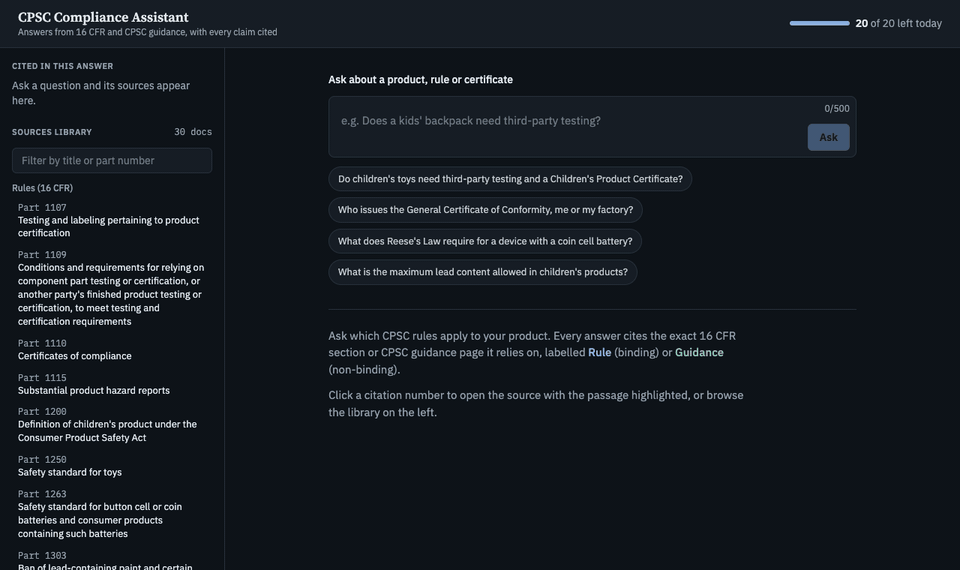
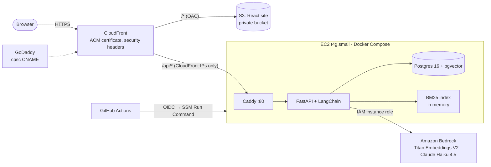
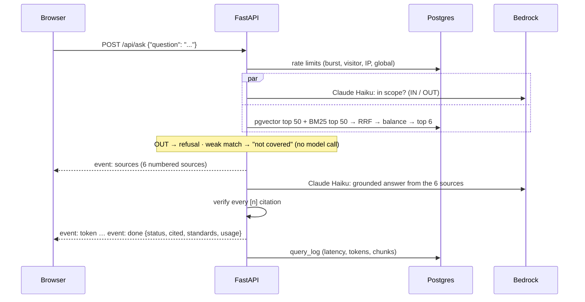

# CPSC Compliance Assistant

[](https://github.com/ZakriyaParacha46/cpsc-compliance-assistant/actions/workflows/pipeline.yml)

**Live: https://cpsc.zakriyaparacha.com**



Ask US consumer product safety (CPSC) compliance questions in plain English and get answers where **every claim is cited** to the exact regulation, statute or CPSC guidance page it came from. Each source is labelled **Rule** (binding regulation), **Law** (binding statute) or **Guidance** (non-binding), and clicking a citation opens the source with the exact passage highlighted.

It's a retrieval-augmented generation (RAG) system on AWS: FastAPI and LangChain retrieve passages from PostgreSQL + pgvector with hybrid BM25 + vector search, and Claude Haiku 4.5 on Amazon Bedrock writes the answer **only** from those passages, with code that verifies every citation before the answer reaches the user.

> Informational only, not legal advice.

---

## Contents
- [Why](#why)
- [Features](#features)
- [Architecture](#architecture)
- [How a question is answered](#how-a-question-is-answered)
- [Data](#data)
- [Retrieval and evaluation](#retrieval-and-evaluation)
- [Guardrails](#guardrails)
- [Security](#security)
- [Tech stack](#tech-stack)
- [Repository layout](#repository-layout)
- [Run it locally](#run-it-locally)
- [Deploy to AWS](#deploy-to-aws)
- [CI/CD](#cicd)
- [Operations](#operations)
- [API reference](#api-reference)
- [Configuration](#configuration)
- [Testing](#testing)
- [Cost](#cost)
- [Limitations and roadmap](#limitations-and-roadmap)

---

## Why

Small sellers, importers and hardware startups can't easily tell which CPSC rules apply to their product. The answer is spread across three kinds of source that don't link to each other:

| Source | What it is | Binding? |
|---|---|---|
| **16 CFR** (Chapter II) | CPSC's regulations | Yes |
| **U.S. Code**: CPSA, FHSA (and the CPSIA amendments to them) | The statutes Congress passed | Yes |
| **CPSC Business Education** pages | Plain-English explanations and FAQs | No |

The hardest questions sit between them, for example whether a product counts as a **children's product** (third-party testing + Children's Product Certificate) or a general-use product (General Certificate of Conformity). General-purpose chatbots answer from memory, cite nothing, and don't separate binding rules from advice.

## Features

- **Cited answers:** every factual sentence ends with `[n]`; code rejects answers with missing or invalid citations.
- **Rule / Law / Guidance badges** on every source.
- **Sources library:** browse all 30 documents, grouped by type.
- **Document viewer:** click a citation and the full source opens, scrolled to the exact passage used, highlighted, with a link to eCFR, govinfo or cpsc.gov.
- **Streaming responses** over Server-Sent Events.
- **"Not covered"** instead of a guess, and a polite refusal for off-topic questions.
- **Paid standards named, not quoted:** e.g. ASTM F963 or UL 4200A are called out as not included.
- **Usage limits without logins:** 20 questions per visitor per day, 40 per IP, 5 per minute, 500 per day globally.
- **Feedback:** 👍 / 👎 per answer, stored with the question.

## Architecture



- **One domain for site and API:** CloudFront serves the static React app from a private S3 bucket and forwards `/api/*` to the server, so the HTTP-only visitor cookie works with no CORS.
- **The server is unreachable directly:** port 80 accepts only CloudFront's origin-facing IP ranges, and Postgres isn't published at all.
- **No stored AWS keys:** the server uses an IAM role; GitHub Actions uses OIDC.
- **Built on the server:** the API image and the site are built from the Git checkout, so there's no container registry.

## How a question is answered



The answer is **buffered, checked, then streamed**, so a user never sees an answer that later gets withdrawn. Time to first word is under 3 seconds.

## Data

| Source | Fetched from | Documents | Sections | Chunks | As of |
|---|---|---:|---:|---:|---|
| **16 CFR** parts 1107, 1109, 1110, 1115, 1200, 1250, 1263, 1303, 1307, 1500, 1700 | [eCFR API](https://www.ecfr.gov/developers/documentation/api/v1) (XML) | 11 | 143 | 340 | 2026-09-22 |
| **CPSA** (15 U.S.C. ch. 47), **FHSA** (ch. 30) | [govinfo API](https://api.govinfo.gov/docs/), U.S. Code 2024 edition | 2 | 72 | 178 | 2025-01-06 |
| **CPSC guidance** (Business Education + FAQs) | Saved from a browser into [`data/cpsc-html/`](data/cpsc-html) | 17 | 181 | 183 | 2026-09-24 |
| **Total** | | **30** | **396** | **701** | |

- **Why the guidance pages are committed:** cpsc.gov blocks automated downloads (HTTP 403 from home and AWS IPs). US government works are public domain, and committing them makes the index reproducible.
- **Section-aware chunking:** one chunk per legal section or FAQ answer; only sections over ~800 tokens are split, on paragraph boundaries with ~100 tokens of overlap. Each chunk keeps its character offsets, which drive the viewer's highlight.
- **Context headers:** each chunk starts with where it came from (`16 CFR § 1263.3 …` or `CPSC guidance (non-binding): Toy Safety`), which helps both retrieval and citation.
- **Idempotent loads:** stable chunk IDs (`cfr-1263:1263.3:0`); reloading a document replaces its chunks.
- **Embeddings:** Amazon Titan Text Embeddings V2, 1024 dimensions, stored in pgvector with an HNSW index. The whole index costs about $0.01 to embed.
- **Not included:** paid standards (ASTM, UL), U.S. Code editorial notes, other agencies (FDA, FCC).

## Retrieval and evaluation

**Hybrid retrieval** ([`api/app/rag/retriever.py`](api/app/rag/retriever.py)):
1. pgvector top 50 by cosine distance **+** BM25 top 50 by keyword score (tokenizer keeps `1263.3`, `f963`).
2. **Reciprocal rank fusion**: `score = Σ 1 / (60 + rank)`.
3. **One chunk per section**, so a long section can't fill all the slots.
4. **Source balancing**: at most 3 guidance chunks and 2 per page, while rules or laws remain, because FAQ pages are phrased like questions and out-rank the legal text that actually binds.
5. **Relevance guard**: if even the closest chunk is further than 0.70, the answer is "not covered" with no model call.

LangChain's `EnsembleRetriever` drops scores, which the relevance guard needs, so this is a custom `BaseRetriever` that still plugs into LCEL chains.

**Evaluation** ([`api/eval/`](api/eval)): a golden set of questions, each listing every source that correctly answers it, plus off-topic questions that must be refused. `make eval` scores every configuration. It calls Titan and the Haiku classifier only (~$0.002 per run).

| Configuration (20-question run) | hit@6 | binding source @6 | MRR | off-topic refused | false refusals |
|---|---:|---:|---:|---:|---:|
| vector only | 17/17 | 10/17 | 0.863 | 3/3 | 0 |
| BM25 only | 15/17 | 9/17 | 0.708 | 3/3 | 0 |
| hybrid | 17/17 | 13/17 | 0.806 | 3/3 | 0 |
| **hybrid + balanced (shipped)** | **17/17** | **16/17** | 0.811 | **3/3** | **0** |

- **hit@6:** a correct source is among the 6 chunks the model sees.
- **binding source @6:** a *rule or law* is among them, not just guidance.
- The golden set has since grown to 22 questions (19 in scope) with two short, vaguely worded questions found in human testing. Those led to a looser relevance threshold (0.61 → 0.70) with the scope classifier as the main off-topic guard.
- The one remaining binding miss is a data gap: Reese's Law Section 3 (battery packaging) lives only in U.S. Code editorial notes, which are excluded.

## Guardrails

| Stage | Guardrail | Protects against |
|---|---|---|
| Input | 1–500 characters (422); Claude Haiku classifier: OUT → polite refusal, not counted | Abuse, other agencies, "ignore your instructions" |
| Retrieval | Closest chunk further than 0.70 → "not covered", no model call | Answering from nothing |
| Prompt | Answer only from numbered sources; cite every factual sentence; apply the general rule to the specific product and state conditions; label rule/law/guidance; name paid standards | Hallucination |
| Prompt | Question in its own `<question>` block; sources as quoted `<source>` data with closing tags neutralised; system prompt never contains user text | Direct and indirect prompt injection |
| Output | Code verifies every `[n]`; missing or invalid citations or `NOT_COVERED` → "not covered"; 800-token cap | Fake citations, runaway cost |
| UI | Disclaimer always shown by the UI, not left to the model | Over-reliance |

## Security

| Secret | Where it lives | Never stored in |
|---|---|---|
| Database password | Generated on the server (`openssl rand -hex 24`), in `/opt/cpsc-rag/.env` with mode 600 | Git, laptops, logs |
| AWS credentials (server) | None stored: IAM instance role, temporary credentials via IMDSv2 | Disk, env files, images |
| AWS credentials (CI) | None stored: GitHub OIDC → a role trusted only by this repo's `production` environment | GitHub secrets |
| SSH private key | Only on the developer's machine, passphrase-protected | Server, repo |
| TLS private key | AWS Certificate Manager (not exportable) | Anywhere else |

- **Edge:** HTTPS only, TLS 1.2+, HSTS, `X-Frame-Options`, `nosniff`, referrer policy (CloudFront managed security headers).
- **Network:** port 80 only from CloudFront's prefix list; SSH from one IP; Postgres and the API not published; Caddy admin API off.
- **Storage:** both S3 buckets private; the site bucket is readable only by this CloudFront distribution (OAC); EBS and S3 encrypted.
- **Identity:** least-privilege roles (Bedrock invoke, own buckets, one distribution's invalidation, SSM on one instance).
- **Application:** validation, one error shape, rate limits keyed on a client IP that trusts only our own proxy hops (forged `X-Forwarded-For` entries are ignored), no debug output in production.
- **Known gaps / next:** lock the origin to this distribution with a secret header; replace SSH with SSM Session Manager; add dependency and image scanning.

## Tech stack

| Layer | Tools |
|---|---|
| API | Python 3.12, FastAPI, Pydantic, Uvicorn |
| RAG | LangChain (`langchain-core`, `langchain-postgres`, `langchain-aws`), rank-bm25 |
| Models | Amazon Bedrock: Titan Text Embeddings V2, Claude Haiku 4.5 (US cross-region profile) |
| Database | PostgreSQL 16 + pgvector 0.8 (HNSW) |
| Ingestion | httpx, lxml |
| Frontend | React 18, TypeScript, Vite, Tailwind CSS v4 |
| Infra | EC2 t4g.small (arm64), Docker Compose, Caddy, S3, CloudFront, ACM, CloudFormation |
| CI/CD | GitHub Actions, GitHub OIDC, AWS Systems Manager Run Command |
| Tooling | uv, ruff, pytest, Make |

## Repository layout

```
api/
  app/
    main.py            FastAPI app: endpoints, visitor cookie, client IP, error shape
    config.py          all settings from environment variables
    limits.py          burst / visitor / IP / global limits (Postgres or in-memory)
    services.py        wires retriever, models and limiter (Bedrock or fake)
    rag/
      pipeline.py      question → events: classify ‖ retrieve → guard → answer → check
      retriever.py     hybrid BM25 + pgvector, RRF, dedupe, source balancing
      prompts.py       classifier and grounded-answer prompts, injection defences
      citations.py     citation check, paid-standard detection
      embeddings.py    Titan V2 as a LangChain Embeddings (parallel, token counting)
      store.py         documents, chunks, query log, feedback
  ingest/              python -m ingest: eCFR, U.S. Code and CPSC page parsers, chunking
  eval/                golden questions and the retrieval eval
  tests/               unit, API and database integration tests
web/src/               React app: sources library, streaming answer, document viewer
data/cpsc-html/        saved CPSC guidance pages (public domain) + AS_OF date
deploy/                compose.prod.yml, Caddyfile
infra/                 CloudFormation: dev-server.yml, public.yml, github-deploy.yml
scripts/               go-prod.sh, deploy.sh, deploy-web.sh
.github/workflows/     pipeline.yml (checks on every push, deploy on main)
Makefile               one entry point for local work, the server and CI
```

## Run it locally

**Requirements:** Docker, [uv](https://docs.astral.sh/uv/), Node 22.

```bash
make setup      # .env from .env.example, Python + Node deps, git pre-push hook
make preview    # UI only, with real 16 CFR sample data and no backend → http://127.0.0.1:5173
```

**The full stack**, offline in fake mode (deterministic embeddings, canned model answers, no AWS):
```bash
make up                 # Postgres + pgvector and the API (hot reload) on :8000
make ingest-download    # fetch the 16 CFR parts from eCFR
make ingest-load ingest-guidance ingest-statutes
make web                # UI on :5173, proxying /api to :8000
```

**With real models:** set `LLM_MODE=bedrock` and `AWS_PROFILE=<profile>` in `.env`. The profile needs Bedrock access to Titan Text Embeddings V2 and Claude Haiku 4.5 in us-east-1.

**Checks** (the same ones CI runs):
```bash
make check      # ruff, format check, pytest, TypeScript, Vite build
make ci-local   # plus Docker image build + smoke test, actionlint, cfn-lint
```

## Deploy to AWS

Three CloudFormation stacks, each deployable from the console (no AWS keys on a laptop):

| Stack | Template | Creates |
|---|---|---|
| `cpsc-rag-dev` | [`infra/dev-server.yml`](infra/dev-server.yml) | EC2 t4g.small (Amazon Linux 2023, arm64), encrypted 20 GB disk, Elastic IP, security group (SSH from one IP), IAM role (Bedrock, own S3 bucket), data bucket; first boot installs Docker, Compose, git, make |
| `cpsc-rag-public` | [`infra/public.yml`](infra/public.yml) | Private S3 site bucket, CloudFront (custom domain, ACM certificate, security headers, `/api/*` → server), port 80 from CloudFront only, web-deploy permissions for the server |
| `cpsc-rag-github` | [`infra/github-deploy.yml`](infra/github-deploy.yml) | GitHub OIDC provider, deploy role limited to SSM commands on the one server |

**First-time setup on the server:**
```bash
git clone https://github.com/ZakriyaParacha46/cpsc-compliance-assistant.git /opt/cpsc-rag && cd /opt/cpsc-rag
cp .env.example .env              # set LLM_MODE=bedrock and DATA_BUCKET
make ingest-download ingest-load ingest-guidance ingest-statutes
make go-prod                      # random DB password, production .env, prod stack up
# after the public stack: add WEB_BUCKET and CF_DISTRIBUTION_ID to .env, TRUSTED_PROXY_HOPS=2
make prod-up && make deploy-web
```

**Custom domain:** request an ACM certificate in us-east-1 (DNS validation), add the validation CNAME at the DNS provider, create `cpsc-rag-public` with the certificate ARN, then point a CNAME for the subdomain at the CloudFront domain.

## CI/CD

[`.github/workflows/pipeline.yml`](.github/workflows/pipeline.yml):

```
every push / PR:  api-check (ruff, pytest + pgvector service) ‖ web-check (tsc, build) ‖ image (arm64 build + smoke)
push to main:     → deploy (GitHub environment "production", main only)
                     1. OIDC → 1-hour AWS credentials (no stored keys)
                     2. SSM Run Command on the server, as ec2-user:
                        git fetch + reset to the exact tested commit → scripts/deploy.sh
                          · rebuild and restart the API, health check
                          · rebuild and publish the site only if web/ changed
                     3. public smoke test: https://cpsc.zakriyaparacha.com/api/health
```

Repository variables: `AWS_ROLE_ARN`, `EC2_INSTANCE_ID`, `AWS_REGION`, `SITE_URL`. There are no repository secrets.

## Operations

Run on the server from `/opt/cpsc-rag`. After `make go-prod`, `.env` sets `COMPOSE_FILE`, so every target uses the production stack.

| Task | Command |
|---|---|
| Deploy the checked-out commit by hand | `git pull && make deploy` |
| Status / API logs | `make ps` / `make logs` |
| Refresh the regulations | `make ingest-download ingest-load`, then `docker compose restart api` (rebuilds the BM25 index) |
| Inspect the index | `make ingest-stats`, `make show S=1263.3`, `make search Q="..."` |
| Ask from the terminal | `make ask Q="Who issues the GCC?"` |
| Retrieval eval | `make eval` (report saved in `data/eval/`) |
| Reset usage limits (testing) | `make reset-limits` |
| Private access over SSH | `make tunnel HOST=<server-ip>` + `make web` → http://127.0.0.1:5173 |
| Save money | Stop the EC2 instance; data, IP and site persist, and containers restart on start |

## API reference

Interactive OpenAPI docs: **`/api/docs`**.

| Method | Path | Returns |
|---|---|---|
| `POST` | `/api/ask` `{"question": "..."}` | Server-Sent Events: `sources` → `token`* → `done` (or `error`) |
| `GET` | `/api/documents` | All documents: id, type, part, title, url, as_of, section_count |
| `GET` | `/api/documents/{id}` | One document with all sections (for the viewer) |
| `GET` | `/api/sources/{chunk_id}` | One chunk's text and metadata |
| `GET` | `/api/usage` | `{"used": 6, "limit": 20, "resets_at": "..."}` for this visitor |
| `POST` | `/api/feedback` `{"query_id": "...", "rating": 1 \| -1}` | 204 |
| `GET` | `/api/health` | DB status, model mode, chunks indexed |

**Stream events:**
```
event: sources   data: {"query_id": "...", "citations": [{"n": 1, "chunk_id": "cfr-1110:1110.7:0", "source_type": "rule",
                        "section": "1110.7", "title": "...", "url": "...", "start": 0, "end": 812}, ...]}
event: token     data: {"text": "For a product made outside the United States, the importer "}
event: done      data: {"query_id": "...", "status": "answered", "cited": [1, 3],
                        "standards": ["ASTM F963-23"], "usage": {"used": 7, "limit": 20, "resets_at": "..."}}
```
`status` is `answered`, `not_covered` or `off_topic`.

**Errors** always have the same shape:
```json
{ "error": { "code": "rate_limited", "message": "Too many questions. Try again in 42 seconds.", "retry_after": 42 } }
```
Codes: `invalid_input` (422), `rate_limited` / `demo_limit_reached` (429, with `Retry-After`), `not_found` (404), `upstream_error` (503, or in-stream).

## Configuration

All settings are environment variables ([`api/app/config.py`](api/app/config.py)); see [`.env.example`](.env.example).

| Variable | Default | Purpose |
|---|---|---|
| `ENV` | `local` | `prod` hides debug reasons and makes the cookie `Secure` |
| `LLM_MODE` | `fake` | `bedrock` for real Titan + Claude; `fake` runs offline |
| `DATABASE_URL` | local Postgres | Connection string |
| `AWS_REGION` | `us-east-1` | Bedrock region |
| `ANSWER_MODEL_ID` | `us.anthropic.claude-haiku-4-5-20251001-v1:0` | Answer and classifier model |
| `EMBED_MODEL_ID` | `amazon.titan-embed-text-v2:0` | Embedding model |
| `DATA_BUCKET` | empty | S3 bucket for raw source copies |
| `GOVINFO_API_KEY` | `DEMO_KEY` | api.data.gov key for the U.S. Code |
| `LIMIT_PER_VISITOR_DAY` / `LIMIT_PER_IP_DAY` / `LIMIT_BURST_PER_MINUTE` / `LIMIT_GLOBAL_DAY` | 20 / 40 / 5 / 500 | Usage limits |
| `MAX_QUESTION_CHARS` / `MAX_OUTPUT_TOKENS` / `MAX_CHUNKS` | 500 / 800 / 6 | Input, output and context caps |
| `RELEVANCE_MAX_DISTANCE` | `0.70` | "Not covered" threshold (cosine distance) |
| `MAX_GUIDANCE` / `MAX_GUIDANCE_PER_PAGE` | 3 / 2 | Source balancing |
| `TRUSTED_PROXY_HOPS` | `0` | Proxies appending to `X-Forwarded-For` (2 in production: CloudFront, Caddy) |

Server-only: `COMPOSE_FILE`, `POSTGRES_USER` / `POSTGRES_PASSWORD` / `POSTGRES_DB`, `WEB_BUCKET`, `CF_DISTRIBUTION_ID`.

## Testing

| Layer | What's covered | Where |
|---|---|---|
| Unit + API (62 tests) | Chunking, the three parsers, BM25 tokenizer, RRF, dedupe and balancing, citation checks, prompt-injection containment, rate limits, SSE event order, 422 / 429, refusals without a model call, dev-only debug reasons, forged IP headers. Bedrock is always faked. | Local + CI |
| Integration (8 tests) | Chunk storage and reloads, search, CLI, document and source endpoints, query log, feedback, atomic Postgres counters | CI, against a real pgvector service container |
| Retrieval eval | 22 golden questions × 5 configurations, including the scope classifier | Server, real models |
| Human testing | 30 items: core questions, typos, other languages, refusals, adversarial prompts, UI, limits, mobile layout | Browser; all pass |

## Cost

| Item | Approximate cost |
|---|---|
| Embedding the whole index | ~$0.01 once |
| EC2 t4g.small + 20 GB disk + Elastic IP | ~$17 / month running, ~$5 stopped |
| Bedrock at ~1,000 questions / month | ~$7 (the global daily cap bounds the worst case) |
| S3, CloudFront, ACM, CloudFormation, IAM | < $1 / month |

## Limitations and roadmap

- **Curated coverage:** 11 of the 100+ CFR parts in Chapter II, 2 statutes, 17 guidance pages. Paid standards aren't included.
- **The eval covers retrieval and refusals**, not answer faithfulness. Next: an answer-level eval (LLM judge + human review).
- **Security next:** a secret origin header so only this CloudFront distribution reaches the server; SSM Session Manager instead of SSH; dependency and image scanning in CI; hashed IPs and log retention.
- **Scale path:** ECS Fargate + RDS + ALB, Postgres full-text search instead of in-memory BM25, a reranker.

---

Built by **Zakriya Paracha**. Data: 16 CFR via eCFR, the U.S. Code via govinfo, and CPSC Business Education pages. All are US government works in the public domain.
